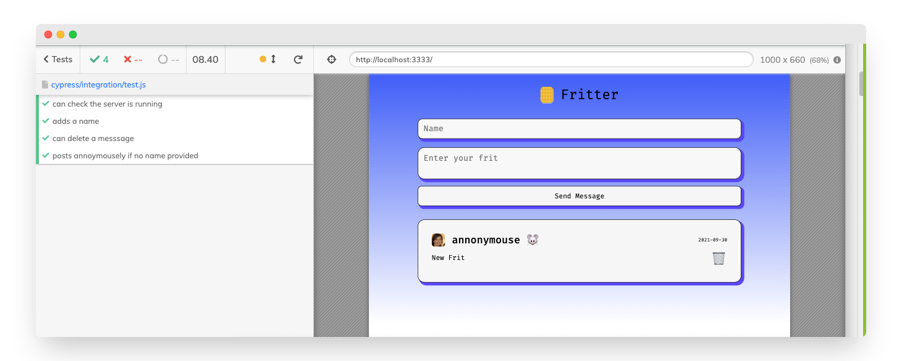
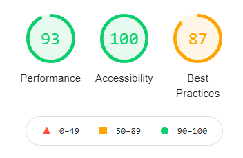
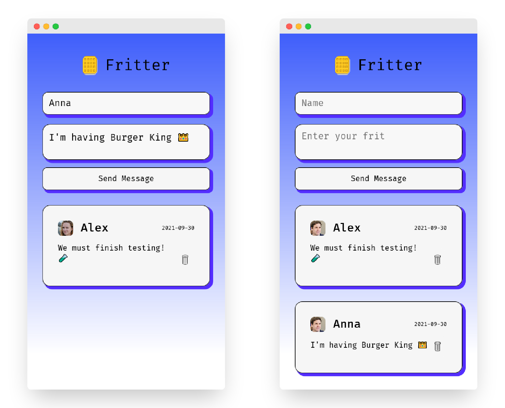

### FRITTER 🐭

100 Character semi-anonymous ephemeral Twitter clone.

Font - [`Fira Code`](https://github.com/tonsky/FiraCode)

### 🧱 Features

- Post 100 character `Frits`
- `Frits` include optional `name` field
- `Frits` stays on page after page `reload`
- `Frits` can be deleted
- `Frits` only stay on server for 30 minutes of inactivity
- `Frits` is fully server side - no client side code
- `CSS` & `favicon` are statically served
- Deployed to `Heroku`
- `Waffles` rotates on hover
- `Frits` are cool

### 📝 User Stories

#### Core

- [x] As an opinionated person, I want to: post my thoughts so others can read them
- [x] As a bored person, I want to: read what other people have posted

#### Stretch

- [x] As an impulsive person, I want to: delete my posts so no one can see them anymore

#### Acceptance Criteria

- [x] A page with a form to submit posts, and a page showing all posts
- [x] No .html files (all HTML responses should be created dynamically within Node)
- [x] No client-side JavaScript (all logic should happen on the server)
- [x] All static assets served correctly (CSS, favicon etc)
- [x] Tests for each server route
- [x] A responsive, mobile-first design
- [x] Ensure your app is accessible to as many different users as possible

### 📚 What we learnt

- Write full application in `Node.js`
- Fully server side
- How to deploy to `Heroku`
- How to server `static` assets
- How to create `modular` code
- How to test with `cypress`
- How to use `BEM` principles in group project
- How to code as a team
- Nothing is perfect

### 🧪 Testing

- [x] Four multi-stage `Cypress` tests complete
      
- [x] Tested in Mobile developer mode on Firefox, Chrome and Edge
- [x] Tested on Apple iPhone 6/7/8
- [x] Desktop version tested on Firefox, Chrome and Edge
- [x] 100 accessibility point score on `lighthouse`

### ⏳ Future improvements

- [ ] Modularise all code
- [ ] Sign-up and Login
- [ ] Database to store `frits`
- [ ] Dark-mode
- [ ] Different profile images for each user
- [ ] Option to share single `frit`
- [ ] Reverse order for tweets

### 👀 Screenshots

